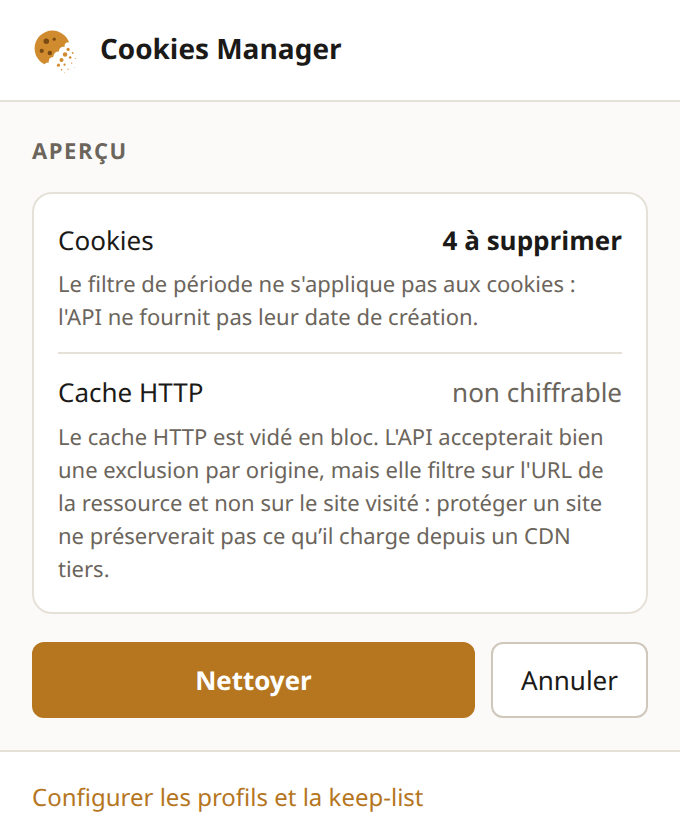
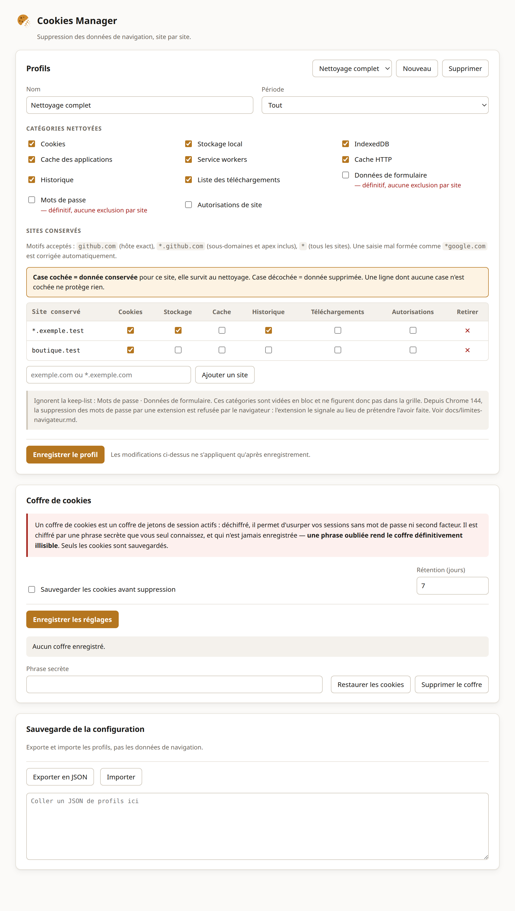

<h1 align="center">Cookies Manager</h1>

<p align="center">
  Chrome extension that deletes browsing data<br>
  <strong>while keeping the data of the sites you list</strong>.
</p>

<p align="center">
  <strong>English</strong> · <a href="README.md">Français</a>
</p>

<p align="center">
  <a href="https://github.com/myqzurdux3/cookies-manager/actions/workflows/ci.yml"></a>
  <a href="LICENSE"></a>
  
  
</p>

<p align="center">
  <picture>
    <source media="(prefers-color-scheme: dark)" srcset="docs/images/popup-sombre.png">
    
  </picture>
</p>

The keep-list crosses with the data categories: keep the cookies of `github.com`
without keeping its history. The preview states exactly what is about to
disappear, before anything is touched.

> The screenshots show the French interface. The extension follows your browser
> language, so it will greet you in English.

## Install

```bash
npm install
npm run build
```

Then `chrome://extensions` → developer mode → “Load unpacked” → pick `dist/`.

## Usage

Clicking the icon opens the popup: pick a profile, read the preview, clean. Two
profiles ship by default, “light” and “full”.

## Language

The interface follows the browser language: French if it starts with `fr`,
English otherwise. The options page lets you force either one; the change
applies immediately, including to the notes the service worker writes itself.

## Configuration

A profile describes a time range, the categories to clean, and a list of sites
to keep.

<p align="center">
  <picture>
    <source media="(prefers-color-scheme: dark)" srcset="docs/images/options-sombre.png">
    
  </picture>
</p>

Accepted patterns:

| You type       | Stored as      | Covers                                                   |
| -------------- | -------------- | -------------------------------------------------------- |
| `github.com`   | `github.com`   | that host exactly, plus its `.github.com` domain cookies |
| `*.github.com` | `*.github.com` | `github.com` and every one of its subdomains             |
| `*`            | `*`            | every site                                               |

Common mistakes are corrected as you type: `*google.com` becomes
`*.google.com`, `.claude.ai` becomes `*.claude.ai`, a pasted URL is reduced to
its host, a unicode name is converted to punycode. `*google.com` is **not**
read as a literal suffix: that would also cover `evilgoogle.com`. A pattern that
cannot be corrected is refused, with the reason.

## Read this before trusting the keep-list

Not every category can be filtered per site, and some do not do what you would
expect. These limits come from Chrome, not from this extension, and each one is
[documented and verified](docs/browser-limits.md) — including these, measured in
a real browser:

- **Passwords**: since Chrome 144, the browser ignores their deletion by an
  extension. The extension detects this and says so, rather than announcing a
  deletion that does not happen.
- **Site permissions**: an extension can only remove its own rules, never the
  ones you granted yourself.
- **History**: deleting a URL erases all of its visits, with no time bound.
- **Partitioned cookies**: the ones a third-party service sets from inside a
  page are invisible to the API, and survive even a full cleaning.
- **HTTP cache**: protectable per site, but the filter applies to the URL of the
  resource — whatever a site loads from a third-party CDN is wiped anyway.

The [cookie vault](docs/vault.md) is optional and off by default: it encrypts
the doomed cookies before deleting them, so they can be restored.

## Privacy

No network request, no telemetry, **no runtime dependency**. Profiles stay in
`chrome.storage.local` and are never synchronised. The `<all_urls>` permission
is used for cookie operations only.

## Security

The threat model, the vault's limits and how to report a vulnerability are in
[SECURITY.en.md](SECURITY.en.md). In short: open a private advisory rather than
a public issue, and never paste real cookie values into a report — those are
live session tokens.

## Contributing

See [CONTRIBUTING.en.md](CONTRIBUTING.en.md). In short: `npm test`,
`npm run lint`, and `npm run verify:browser`, which loads the extension into a
real browser.

The audit (`docs/AUDIT.md`) and the manual test plan are in French only: they
are working documents. Everything a newcomer reads is bilingual.

## Licence

MIT — see [LICENSE](LICENSE).
